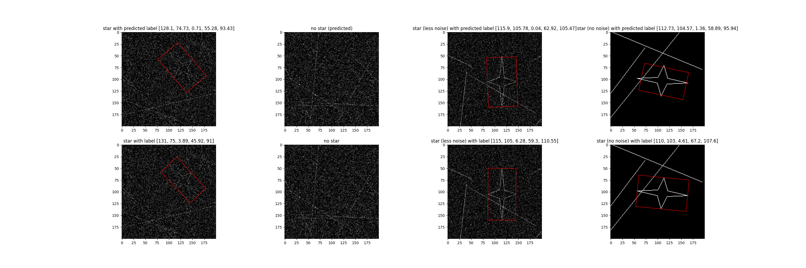

# Computer Vision take-home: Astronomy (Vishal Saranathan)

**Problem:**
You are given a data synthesizer which generates images and labels. Your goal is to train a model with at most 4.5 million trainable parameters which determines whether each image has a star and, if so, finds a rotated bounding box that bounds the star.

More precisely, the labels contain the following five numbers, which your model should predict:
* the x and y coordinates of the center
* yaw
* width and height.

If there is no star, the label consists of 5 `np.nan`s. The height of the star is always noticeably larger than its width, and the yaw points in one of the height directions. The yaw is always in the interval `[0, 2 * pi)`, oriented counter-clockwise and with zero corresponding to the upward direction.
For your reference, train.py contains a basic CNN architecture (and training code) which performs poorly and. You can extend this model/training or start over on your own.

**Star Model:**<br>
- Model Parameter count: 4,284,326
- Run ```python3 compute_score.py``` to run evaluation
- Run ```python3 test_model.py``` to display model results and visually compare against ground truth

- Evaluation scores:
    - #IoU > 0.5 : 0.9562575941676792  (96%)
    - #IoU > 0.7:  0.7703523693803159 (78%)
    - Mean IoU:  0.7463775936780163
- The model consists of two heads - a bounding box regression head and a classification head
- The model is trained on 250,000 data points, through a specific transfer learning where the model is trained from scratch to perform bounding box regression and then finetuned for performing classification
- The custom loss function used was proposed in the paper [IoU Loss for 2D/3D Object Detection](https://arxiv.org/pdf/1908.03851.pdf) (2019) by Zhou et. al; its used for training the regression head (the code for the same is present in the custom_loss directory)
- The loss criterion for classification is Binary Cross Entropy
- The optimizer is Stochastic Gradient Descent 
- The threshold for classification is 0.5

```
StarModel(
    
  (conv1): Sequential(

    (0): Conv2d(1, 32, kernel_size=(3, 3), stride=(1, 1), padding=(1, 1))
    (1): BatchNorm2d(32, eps=1e-05, momentum=0.1, affine=True, track_running_stats=True)
    (2): ReLU()
    (3): MaxPool2d(kernel_size=2, stride=2, padding=0, dilation=1, ceil_mode=False)
  )

  (conv2): Sequential(
  
    (0): Conv2d(32, 64, kernel_size=(3, 3), stride=(1, 1), padding=(1, 1))
    (1): BatchNorm2d(64, eps=1e-05, momentum=0.1, affine=True, track_running_stats=True)
    (2): ReLU()
    (3): MaxPool2d(kernel_size=2, stride=2, padding=0, dilation=1, ceil_mode=False)
  )
  (conv3): Sequential(
  
    (0): Conv2d(64, 128, kernel_size=(3, 3), stride=(1, 1), padding=(1, 1))
    (1): BatchNorm2d(128, eps=1e-05, momentum=0.1, affine=True, track_running_stats=True)
    (2): ReLU()
    (3): MaxPool2d(kernel_size=2, stride=2, padding=0, dilation=1, ceil_mode=False)
  )
  (conv4): Sequential(
  
    (0): Conv2d(128, 128, kernel_size=(3, 3), stride=(1, 1), padding=(1, 1))
    (1): BatchNorm2d(128, eps=1e-05, momentum=0.1, affine=True, track_running_stats=True)
    (2): ReLU()
    (3): MaxPool2d(kernel_size=2, stride=2, padding=0, dilation=1, ceil_mode=False)
  )
  (conv5): Sequential(
  
    (0): Conv2d(128, 256, kernel_size=(3, 3), stride=(1, 1), padding=(1, 1))
    (1): BatchNorm2d(256, eps=1e-05, momentum=0.1, affine=True, track_running_stats=True)
    (2): ReLU()
  )
  (conv6): Sequential(
  
    (0): Conv2d(256, 256, kernel_size=(3, 3), stride=(1, 1), padding=(1, 1))
    (1): BatchNorm2d(256, eps=1e-05, momentum=0.1, affine=True, track_running_stats=True)
    (2): ReLU()
  )
  (conv7): Sequential(
  
    (0): Conv2d(256, 32, kernel_size=(3, 3), stride=(1, 1), padding=(1, 1))
    (1): BatchNorm2d(32, eps=1e-05, momentum=0.1, affine=True, track_running_stats=True)
    (2): ReLU()
  )
  (classification): Sequential(
  
    (0): Linear(in_features=4608, out_features=128, bias=True)
    (1): Dropout(p=0.2, inplace=False)
    (2): BatchNorm1d(128, eps=1e-05, momentum=0.1, affine=True, track_running_stats=True)
    (3): ReLU()
    (4): Linear(in_features=128, out_features=1, bias=True)
    (5): Sigmoid()
  )
  (regression): Sequential(
  
    (0): Linear(in_features=4608, out_features=512, bias=True)
    (1): Dropout(p=0.2, inplace=False)
    (2): ReLU()
    (3): Linear(in_features=512, out_features=256, bias=True)
    (4): Dropout(p=0.2, inplace=False)
    (5): BatchNorm1d(256, eps=1e-05, momentum=0.1, affine=True, track_running_stats=True)
    (6): ReLU()
    (7): Linear(in_features=256, out_features=5, bias=True)
  )
)

```

